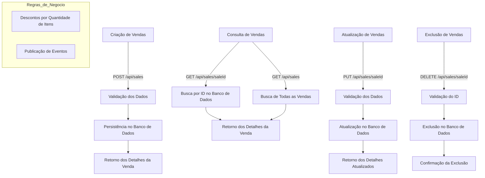
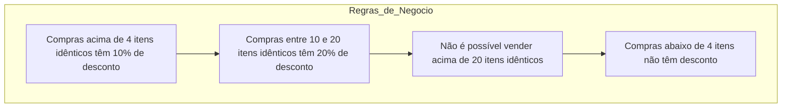

# Documentação do Projeto

## Como Rodar o Projeto

Este projeto foi projetado para rodar em um ambiente Dockerizado, facilitando a configuração e execução. Siga os passos abaixo para começar:

### Pré-requisitos
1. Certifique-se de ter o Docker e o Docker Compose instalados na sua máquina.
2. Clone este repositório para sua máquina local.

### Passos para Rodar
1. Abra um terminal e navegue até o diretório do projeto.
2. Execute o script `run-database-setup.bat` para configurar o banco de dados e inicializar as tabelas necessárias. Este script irá:
   - Iniciar os containers Docker usando o arquivo `docker-compose.override.yml`.
   - Inicializar o banco de dados com o script `init-database.sql`.
   - Exibir os dados das tabelas `Products` e `Customers` para verificação.

   Para executar o script, basta rodar:
   ```
   run-database-setup.bat
   ```

3. Após a conclusão do script, o banco de dados estará pronto e você poderá prosseguir para rodar a aplicação.

### Informações Adicionais
- O script `run-database-setup.bat` simplifica o processo de configuração automatizando as seguintes tarefas:
  - Inicialização dos containers Docker.
  - Execução do script de inicialização SQL.
  - Exibição do conteúdo das tabelas `Products` e `Customers` para verificação.

- Os IDs das tabelas `Products` e `Customers` são exibidos durante a execução do script para sua referência.

### Rodando a Aplicação
Após configurar o banco de dados, você pode rodar a aplicação executando os comandos apropriados ou utilizando sua IDE preferida para iniciar o projeto.

Para quaisquer problemas ou dúvidas, consulte o README do projeto ou entre em contato com a equipe de desenvolvimento.

## Fluxo de Funcionamento do Módulo de Sales




